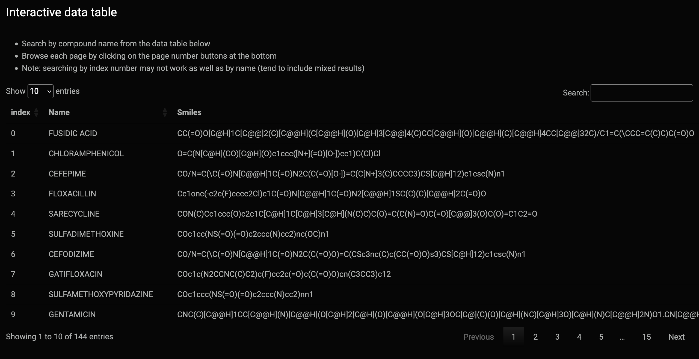

### Molviz_app - Molecule visualiser web application

*The final deployed app (with file name as app.py) is built from venv using Python 3.9 which is compatible with Shinyapps.io (note: Python 3.11 not compatible yet)*

Please see this blog post <a rel="link" href="https://jhylin.github.io/Data_in_life_blog/posts/15_Molviz/Molviz.html"> or visit https://jhylin.github.io/Data_in_life_blog/posts/15_Molviz/Molviz.html for full details about this web application. For data preparation, please see this post <a rel="link" href="https://jhylin.github.io/Data_in_life_blog/posts/15_Molviz/itables.html"> or visit https://jhylin.github.io/Data_in_life_blog/posts/15_Molviz/itables.html.

 

#### Quick glimpse at the application

 

 This work is licensed under a <a rel="license" href="http://creativecommons.org/licenses/by-sa/4.0/">Creative Commons Attribution-ShareAlike 4.0 International License</a>.