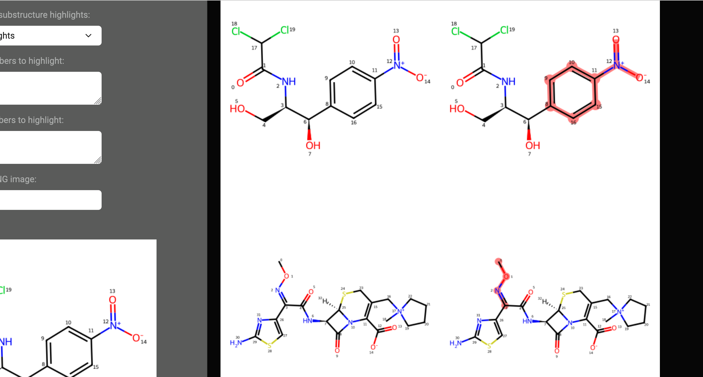

### Molviz_app - Molecule visualiser web application

*The final deployed app (with file name as app.py) is built from venv using Python 3.9 which is compatible with Shinyapps.io (note: Python 3.11 not compatible yet)*

*A blog post is being written currently with explanations and details of this application - once this is completed, it'll be added to this README.md*

 

#### Quick glimpse at this application

 

 This work is licensed under a <a rel="license" href="http://creativecommons.org/licenses/by-sa/4.0/">Creative Commons Attribution-ShareAlike 4.0 International License</a>.